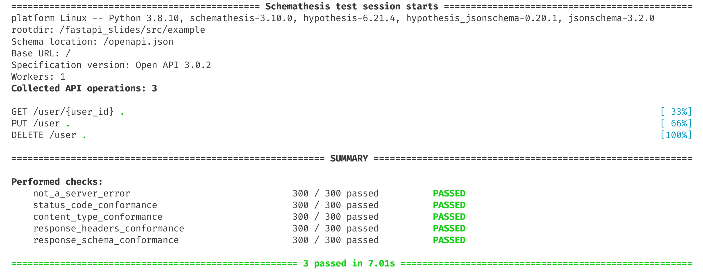

Documentation: https://fastapi.tiangolo.com

Source Code: https://github.com/tiangolo/fastapi

---

# Design goals

- Fast
- Good IDE support (autocompletion)
- Minimal boilerplate
- Standards based
- Easily testable
---


---

# Features

- Fully async
- Good documentation
- Full featured:
  *WebSockets, GraphQL, CORS, GZip, Static Files, Templating, Streaming responses, Background Tasks, Startup and shutdown events, ...*
- Automatic data validation
- Test client built on `requests` API.
- 100% test coverage.
- 100% type annotated codebase.

---

# Leverages standard Python type hints

- Type checking
- IDE auto-completion
- Data validation
- Data serialization
- Automatic API documentation
- Automatic OpenAPI schema generation

---

# Basic example (no data validation)

```python
from fastapi import FastAPI

api = FastAPI()

@api.get("/user/{user_id}")
def get_user(user_id):
    user = db.find(user_id)
    return user

@api.put("/user")
def create_user(user):
    user_id = db.create(user)
    return user_id
```

---

# Automatic data validation (Pydantic)

```python
from fastapi import FastAPI
from pydantic import BaseModel

class User(BaseModel):
    last_name: str
    first_name: str
    age: int

api = FastAPI()

@api.get("/user/{user_id}", response_model=Optional[User])
def get_user(user_id: int):
    user = db.find(user_id)
    return user

@api.put("/user", response_model=int)
def create_user(user: User):
    user_id = db.create(user)
    return user_id
```

---

# Error handling

- Automatic handling of data validation errors
- `HTTPException` for custom errors handling

```python
@api.get(
    "/user/{user_id}",
    response_model=User,
    responses={status.HTTP_404_NOT_FOUND: {"model": HTTPError}},
)
def get_user(user_id: int):
    user = db.find(user_id)
    if user is None:
        raise HTTPException(
            status_code=status.HTTP_404_NOT_FOUND,
            detail=f"User '{user_id}' does not exist.",
        )
    return user
```

---

# Testing

```python
from http import HTTPStatus
from fastapi.testclient import TestClient
from example.main import api

demo_user = {"first_name": "Peter", "last_name": "Higgs", "age": 92}

def test_create_user():
    client = TestClient(api)
    response = client.put("/user", json=demo_user)

    assert response.status_code == HTTPStatus.OK
    assert response.text == str(0)

    response = client.get("/user/0")
    assert response.status_code == HTTPStatus.OK
    assert response.json() == demo_user

    response = client.get("/user/1")
    assert response.status_code == HTTPStatus.NOT_FOUND
    assert response.json() == {"detail": "User '1' does not exist."}
```

---

# Fuzzing with [Hypothesis](https://hypothesis.readthedocs.io)

```python
from http import HTTPStatus
from fastapi.testclient import TestClient
from hypothesis import given, strategies as st
from example.main import api, User

def test_inserting_random_users():
    client = TestClient(api)

    @given(st.builds(User, age=st.integers(1, 99)))
    def insert_user(random_user: User):
        response = client.put("/user", json=random_user.dict())
        assert response.status_code == HTTPStatus.OK
        user_id = int(response.text)

        response = client.get(f"/user/{user_id}")
        assert response.status_code == HTTPStatus.OK
        assert response.json() == random_user.dict()

    insert_user()
```

---

# Schema compliance with [Schemathesis](https://schemathesis.readthedocs.io)

```bash
❯ schemathesis run --checks all --app=main:api /openapi.json
```



---

# Schema compliance as a pytest test
```python
import schemathesis
from schemathesis.checks import ALL_CHECKS

from example.main import api

schema = schemathesis.from_dict(
    api.openapi(),
    data_generation_methods=[
        schemathesis.DataGenerationMethod.positive,  # generates valid data
        schemathesis.DataGenerationMethod.negative,  # generates invalid data
    ],
)

@schema.parametrize()
def test_schema_compliance(case):
    response = case.call_asgi(api)
    case.validate_response(response, checks=ALL_CHECKS)
```
---


